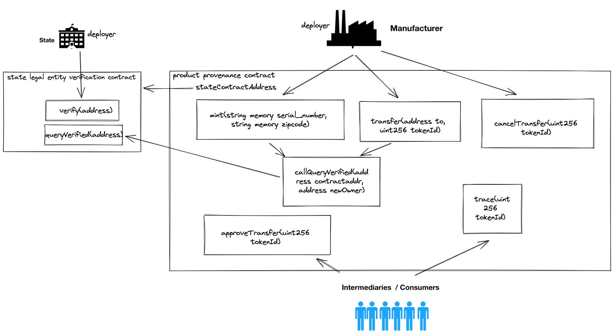

## Screenshot

## WORKING DIAGRAM OF THE CONTRACTS

## Docs
Please look at the reports
* [cmpe483_assignment_1_report.pdf](./cmpe483_assignment_1_report.pdf)
* [CMPE_483_ASSIGNMENT_2_REPORT.pdf](./CMPE_483_ASSIGNMENT_2_REPORT.pdf)

## Scripts
* `yarn` to install dependencies(package.json)
* `yarn contracts:compile` to compile contracts to abi json (truffle)
* `yarn fe:build` to build frontend (next.js)
* `yarn fe:dev` to compile contracts to abi json and start frontend development server

## Resources
* https://www.dappuniversity.com/articles/how-to-build-a-blockchain-app
