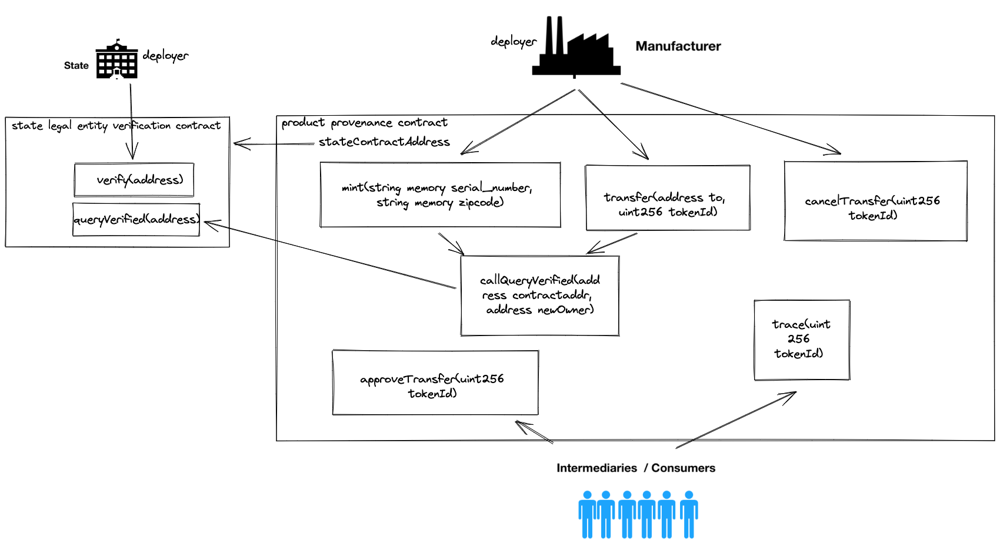

## WORKING DIAGRAM OF THE CONTRACTS

## Docs
Please look at the pdf file

## Testing
* `yarn` to install dependencies(package.json)
* `yarn truffle test` to start test
* `yarn truffle compile` to compile contracts to abi json

## Resources
* https://www.dappuniversity.com/articles/how-to-build-a-blockchain-app